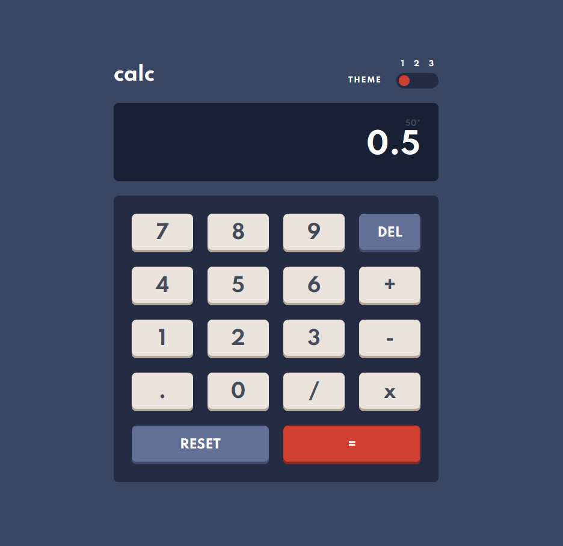

# Frontend Mentor - Calculator app solution

This is a solution to the [Calculator app challenge on Frontend Mentor](https://www.frontendmentor.io/challenges/calculator-app-9lteq5N29). Frontend Mentor challenges help you improve your coding skills by building realistic projects.

## Overview

### The challenge

Users should be able to:

-   See the size of the elements adjust based on their device's screen size
-   Perform mathmatical operations like addition, subtraction, multiplication, and division
-   Adjust the color theme based on their preference
-   **Bonus**: Have their initial theme preference checked using `prefers-color-scheme` and have any additional changes saved in the browser

### Screenshot

### Links

-   Solution URL: [https://github.com/kitsunekyo/frontendmentor.io](https://github.com/kitsunekyo/frontendmentor.io)
-   Live Site URL: [https://gallant-williams-2db4cc.netlify.app/](https://gallant-williams-2db4cc.netlify.app/)

## My process

### Built with

-   Semantic HTML5 markup
-   CSS custom properties
-   Flexbox
-   CSS Grid
-   Mobile-first workflow
-   [React](https://reactjs.org/) - JS library
-   Jest + React Testing Library

### What I learned

How complicated calculator inputs actually are. Not like your typical control flow but has a ton more states. So might be a good place for a statemachine. (x-state anyone?)

Also I've never worked with preferred color scheme, which is fun.
