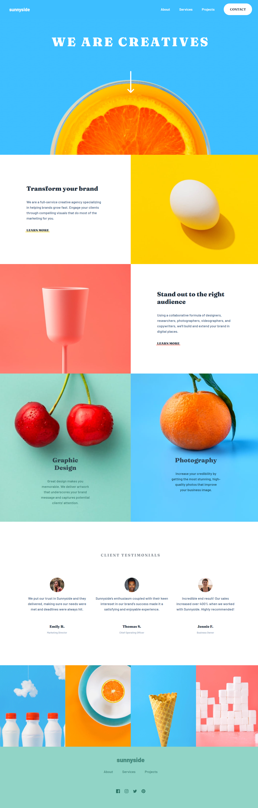

# Frontend Mentor - Sunnyside agency landing page solution

[](https://app.netlify.com/sites/competent-bassi-6c13b8/deploys)

This is a solution to the [Sunnyside agency landing page challenge on Frontend Mentor](https://www.frontendmentor.io/challenges/sunnyside-agency-landing-page-7yVs3B6ef). Frontend Mentor challenges help you improve your coding skills by building realistic projects.

## Overview

### The challenge

Users should be able to:

-   View the optimal layout for the site depending on their device's screen size
-   See hover states for all interactive elements on the page

### Screenshot



### Links

-   Solution URL: [https://github.com/kitsunekyo/frontendmentor.io/tree/main/sunnyside-agency-landing-page](https://github.com/kitsunekyo/frontendmentor.io/tree/main/sunnyside-agency-landing-page)
-   Live Site URL: [https://competent-bassi-6c13b8.netlify.app/](https://competent-bassi-6c13b8.netlify.app/)

## My process

Not having built a basic landingpage for some time I approached this very generically. I built component by component in mobile first, switching to desktop once I was done. Mobile menu was also added after the basic layout was standing.

I considered going with a utility first approach, but decided to keep it component based for the rather specific styles per component on this page.

### Built with

-   Semantic HTML5 markup
-   CSS custom properties
-   Flexbox
-   CSS Grid
-   Mobile-first workflow
-   Vite - build tooling

### 📒 Notes

**extra wide screens**

I'm working with an ultrawide curved monitor and quickly noticed that this layout would be tricky to get working for extremely large screens. In a real project I would talk to the designer, and see if they had anything in mind, or if there were no designer I would most likely have limited the page to a maximum size (wrapped with a container for xxl screens).

Also some images don't really scale well for larger screens. So there would be a compromise between style and practicality.
For the "graphic design" and "photography" sections i opted for containing the image, and providing a background color, so we ensure readability.

**zero js menu**

when working with extremely simple websites with a mobile menu, a nice trick is to opt for a hidden `input:checkbox` and toggle the menu visibility via adjecent selectors

```css
/* header.scss */
.showMenu:checked ~ .header__mobile-nav {
    display: block;
}
```

**media query mixins**

when already working with scss, i really like the idea to abstract away breakpoints. unfortunately breakpoints can't take css custom props, so we would have to duplicate every breakpoint value. while we could use a scss variable, I prefer not to use them interchangably with css custom props and opt for mixins instead. Its shorter too. 😉

**proper scss imports**

for ages, the recommended way of importing scss modules is via `@use`. NOT `@import` (import is discouraged actually. read more [here](https://sass-lang.com/documentation/at-rules/import))

**logo**

the logo was sent as svg file. but in order to use it in the footer I had to do some modifications. the viewbox attribute was missing, and without it scaling would be annoying. I opted to set the viewbox to the initial svg size, so the path scales properly with any css size set.

i also removed the `fill` attribute, so I could set it easily via css.
