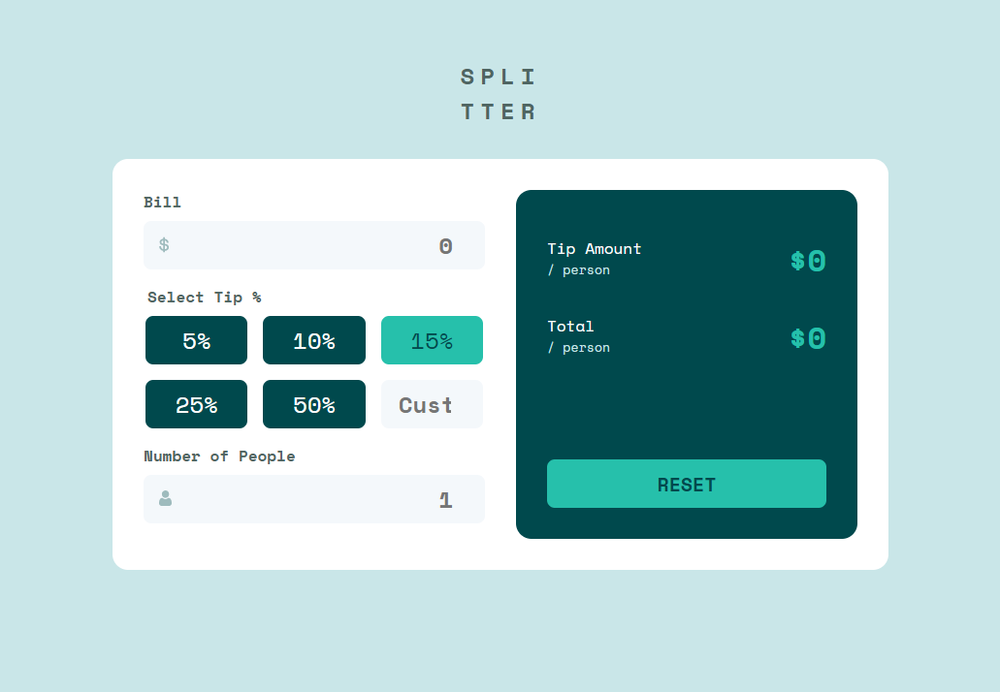

# Frontend Mentor - Tip calculator app solution

| This is a solution to the [Tip calculator app challenge on Frontend Mentor](https://www.frontendmentor.io/challenges/tip-calculator-app-ugJNGbJUX). Frontend Mentor challenges help you improve your coding skills by building realistic projects.

## Overview

### The challenge

Users should be able to:

-   View the optimal layout for the app depending on their device's screen size
-   See hover states for all interactive elements on the page
-   Calculate the correct tip and total cost of the bill per person

### Screenshot

### Links

-   Solution URL: [https://github.com/kitsunekyo/tip-calculator-app](https://github.com/kitsunekyo/tip-calculator-app)
-   Live Site URL: [https://mystifying-montalcini-aed724.netlify.app/](https://mystifying-montalcini-aed724.netlify.app/)

## My process

### Built with

-   Vite
-   Semantic HTML5 markup
-   CSS custom properties
-   CSS Grid

### What I learned

After building SPAs for some time, and being distracted by Infrastructure, DevOps, and Management topics I tried to jump back into classic bare-metal frontend development to see where I'm at. I tend to think to complicated, so I tried to follow the AHA and KISS principle with this project.
